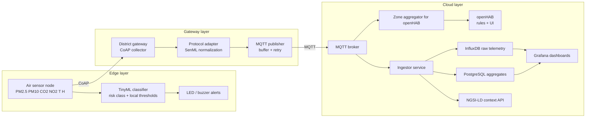

# Архітектура системи моніторингу якості повітря

## 1. Мета системи

Система призначена для міської мережі з 50+ сенсорів, розміщених у житлових, промислових, паркових і транспортних зонах. Кожен сенсор вимірює:

- `PM2.5`
- `PM10`
- `CO2`
- `NO2`
- температуру
- відносну вологість

Ключові цілі:

- безперервний збір телеметрії з мінімальним енергоспоживанням
- інтероперабельність з міськими платформами Smart City
- локальна автономність при втраті зв'язку
- підтримка аналітики і візуалізації у near real time
- операторський моніторинг і правила реагування через `openHAB`

## 2. Вибір стандарту інтероперабельності

Для цього варіанту обрано `FIWARE NGSI-LD`.

Обґрунтування:

- модель підходить для Smart City сценаріїв і контекстних сутностей на кшталт `AirQualityObserved`
- `NGSI-LD` дозволяє описувати сутності, властивості, відношення і геопросторовий контекст
- стандарт добре поєднується з окремим ingestion-рівнем на `MQTT` і аналітичним шаром на `InfluxDB`/`PostgreSQL`
- підхід дозволяє надалі інтегрувати систему з міськими порталами відкритих даних

## 3. Вибір протоколів зв'язку

| Сегмент | Протокол | Причина вибору |
|---|---|---|
| Sensor -> Gateway | `CoAP` | легкий UDP-протокол для constrained-пристроїв, нижче енергоспоживання, зручний confirmable режим |
| Gateway -> MQTT Broker | `MQTT` | pub/sub для масового ingestion, мінімальні накладні витрати, проста буферизація і ретрансляція |
| Cloud API / NGSI-LD / OTA | `HTTP` | стандартний REST-підхід для інтеграції сервісів, dashboard, керування і оновлень |

## 4. Формат даних

Базовий телеметричний формат: `SenML` (`RFC 8428`).

Приклад пакета від одного сенсора:

```json
[
  {
    "bn": "urn:ngsi-ld:AirQualityObserved:sensor-014:",
    "bt": 1774586400,
    "n": "pm25",
    "u": "ug/m3",
    "v": 18.4
  },
  {
    "n": "pm10",
    "u": "ug/m3",
    "v": 31.2
  },
  {
    "n": "co2",
    "u": "ppm",
    "v": 521.7
  },
  {
    "n": "no2",
    "u": "ug/m3",
    "v": 27.5
  },
  {
    "n": "temperature",
    "u": "Cel",
    "v": 16.8
  },
  {
    "n": "humidity",
    "u": "%RH",
    "v": 62.1
  },
  {
    "n": "zone",
    "vs": "industrial"
  },
  {
    "n": "lat",
    "u": "deg",
    "v": 50.4652
  },
  {
    "n": "lon",
    "u": "deg",
    "v": 30.5126
  }
]
```

## 5. Mermaid-діаграма архітектури



## 6. Логічні компоненти

### 6.1 Edge sensor

- мікроконтролер або `Raspberry Pi`-сумісний вузол
- пакетне вимірювання кожні `30-60 секунд`
- локальне збереження останніх `N` пакетів при втраті зв'язку
- локальна класифікація рівня забруднення

### 6.2 Gateway

- збір телеметрії від групи сенсорів району
- перевірка схеми `SenML`
- маркування зони і координат
- передавання у брокер `MQTT`

### 6.3 Cloud

- ingestion сервіс перетворює `SenML` у формат, зручний для time-series storage
- окремий `zone aggregator` будує зональні MQTT-стани для `openHAB`
- `openHAB` надає операторський інтерфейс, сповіщення та правила
- сирі дані йдуть у `InfluxDB`
- погодинні і денні агрегати зберігаються в `PostgreSQL`
- `Grafana` будує KPI, карти і тренди
- `NGSI-LD` API публікує узгоджений міський контекст

## 7. Канонічна сутність NGSI-LD

Логічне відображення сенсора в міському контексті:

```json
{
  "id": "urn:ngsi-ld:AirQualityObserved:sensor-014",
  "type": "AirQualityObserved",
  "address": {
    "type": "Property",
    "value": {
      "zone": "industrial"
    }
  },
  "location": {
    "type": "GeoProperty",
    "value": {
      "type": "Point",
      "coordinates": [30.5126, 50.4652]
    }
  },
  "pm25": {
    "type": "Property",
    "value": 18.4
  },
  "pm10": {
    "type": "Property",
    "value": 31.2
  },
  "co2": {
    "type": "Property",
    "value": 521.7
  },
  "no2": {
    "type": "Property",
    "value": 27.5
  },
  "temperature": {
    "type": "Property",
    "value": 16.8
  },
  "relativeHumidity": {
    "type": "Property",
    "value": 62.1
  }
}
```

## 8. Обґрунтування архітектури

- `CoAP` мінімізує споживання батареї на edge-рівні.
- `MQTT` добре масштабується на десятки й сотні сенсорів і спрощує повторну доставку.
- `SenML` дає компактне подання пакетів для constrained-пристроїв.
- `openHAB` дає практичний runtime для операторських правил, алертів і локальної HMI.
- `FIWARE NGSI-LD` зберігає інтероперабельність поза межами конкретної бази даних або dashboard.
- розділення `raw telemetry` і `aggregated analytics` зменшує навантаження на dashboard і спрощує retention policy.
