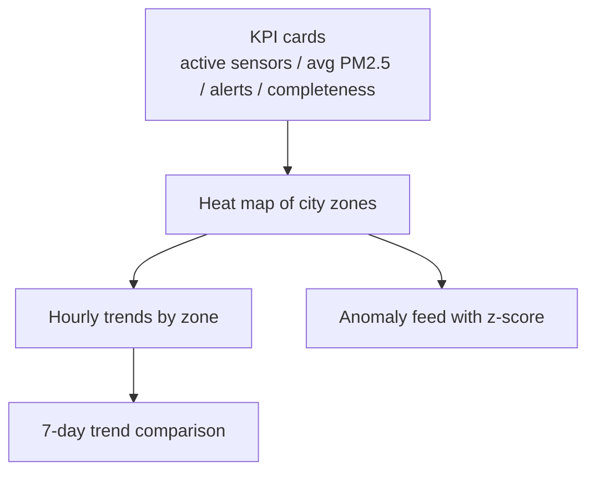

# Макет dashboard

## 1. Основна структура

## 2. Панелі

### 2.1 KPI cards

- кількість активних сенсорів
- середній `PM2.5` по місту
- кількість активних тривог
- повнота даних за останню годину

### 2.2 Карта забруднення

- базова карта міста з маркерами або heat layer
- колір зони визначається найвищим рівнем ризику
- підказка на hover показує `PM2.5`, `PM10`, `CO2`, `NO2`, температуру та вологість

### 2.3 Графіки по зонах

- погодинний тренд `PM2.5`
- денний тренд `NO2`
- порівняння житлової та промислової зон
- таблиця топ-5 сенсорів з найвищими піками

### 2.4 Стрічка аномалій

- час події
- зона
- сенсор
- метрика
- `z-score`

## 3. Логіка кольорів

- зелений: `добре`
- жовтий: `помірне`
- помаранчевий: `шкідливе`
- червоний: `небезпечне`

## 4. Приклад користувацького сценарію

Оператор міського центру моніторингу відкриває dashboard і одразу бачить:

- чи всі 50+ сенсорів активні
- у яких зонах спостерігається перевищення `PM2.5`
- чи є аномальний стрибок `NO2` біля транспортного вузла
- як змінився стан порівняно з попередніми `7 днями`
