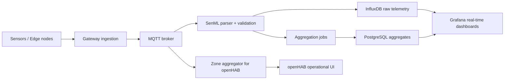

# Data Pipeline та аналітика

## 1. Схема pipeline



## 2. Стадії обробки

### 2.1 Ingestion

- edge-вузли формують `SenML` пакет
- gateway виконує перевірку обов'язкових полів: `bn`, `bt`, `n`, `u`, `v/vs`
- телеметрія публікується в `MQTT` topic:

```text
airquality/{zone}/{sensor_id}/measurements
```

### 2.2 Processing

- сервіс `ingestor` читає `MQTT` потік
- пакет `SenML` перетворюється на плоску структуру для time-series запису
- невалідні повідомлення спрямовуються в `dead-letter` topic
- на рівні gateway або cloud розраховуються rolling window метрики

### 2.3 Storage

| Тип даних | Сховище | Призначення |
|---|---|---|
| Сирі вимірювання по секундах/хвилинах | `InfluxDB` | near real time, retention, оперативна аналітика |
| Погодинні та денні агрегати | `PostgreSQL` | звіти, BI, порівняння зон, довгострокові тренди |
| Метадані сенсорів та контекст | `NGSI-LD` модель | інтероперабельність, Smart City інтеграції |

### 2.4 Visualization

- `Grafana` читає сирі ряди з `InfluxDB`
- зональні агрегати і weekly trend читаються з `PostgreSQL`
- карта забруднення будується за координатами і кольоровими індикаторами ризику
- `openHAB` споживає зональні MQTT-стейти для оперативних алертів і правил

## 3. Правила якості даних

- timestamp не може відставати більше ніж на `5 хвилин`
- `PM2.5`, `PM10`, `CO2`, `NO2` не можуть бути від'ємними
- температура очікується в діапазоні `-40 .. +70`
- вологість очікується в діапазоні `0 .. 100`
- повідомлення без `sensor_id`, `zone` або координат не беруть участі в просторовій візуалізації

## 4. Приклад перетворення `SenML` -> ряд аналітики

Після парсингу пакет набуває логічної форми:

```json
{
  "sensor_id": "sensor-014",
  "zone": "industrial",
  "timestamp": "2026-03-27T09:00:00Z",
  "lat": 50.4652,
  "lon": 30.5126,
  "pm25": 18.4,
  "pm10": 31.2,
  "co2": 521.7,
  "no2": 27.5,
  "temperature": 16.8,
  "humidity": 62.1
}
```

## 5. Стратегія зберігання

### 5.1 Raw layer: `InfluxDB`

- retention policy: `90 днів`
- granularity: первинні вимірювання без усереднення
- використання: alarm correlation, real-time dashboard, перевірка якості телеметрії

### 5.2 Aggregate layer: `PostgreSQL`

- таблиці `zone_hourly_aggregates` і `zone_daily_aggregates`
- використання: звіти для міської адміністрації, порівняння районів, тижневі тренди
- схема знаходиться у файлі `sql/schema_postgresql.sql`

## 6. Аналітичні запити

Запити збережені у файлі `sql/analytics_queries.sql`. Нижче наведено логіку.

### 6.1 Середні значення за годину

- середнє по зоні для `PM2.5`, `PM10`, `CO2`, `NO2`
- кількість отриманих вимірювань
- відсоток completeness від очікуваного обсягу

### 6.2 Виявлення аномалій через `z-score`

Формула:

```text
z = (x - mean) / stddev
```

Правило:

- `|z| >= 3` -> аномалія

### 6.3 Тренди за тиждень

- щоденні середні за останні `7 днів`
- slope тренду для кожної зони
- порівняння з попереднім тижнем

## 7. KPI data pipeline

- `pipeline_latency_p95` - різниця між `bt` у `SenML` і часом появи точки в `InfluxDB`
- `data_completeness_pct` - отримані записи / очікувані записи
- `sensor_uptime_pct` - частка інтервалів, у яких сенсор подавав heartbeat
- `invalid_message_rate` - частка пакетів, що не пройшли валідацію
