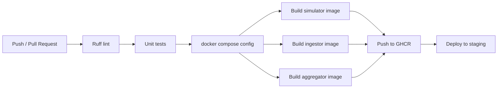

# DevOps та CI/CD

## 1. CI/CD pipeline

Workflow знаходиться у `.github/workflows/ci-cd.yml` і складається з етапів:

- `lint`
- `test`
- `build Docker images`
- `deploy to staging`

Послідовність:

## 2. Локальне середовище

`docker-compose.yml` піднімає:

- `Mosquitto` як `MQTT broker`
- `InfluxDB` для сирих рядів
- `PostgreSQL` для агрегатів
- `Grafana` для візуалізації
- `edge-simulator` для генерації 50+ потоків телеметрії
- `ingestor` для приймання `SenML` та запису в `InfluxDB`
- `aggregator` для публікації зональних станів у `openHAB`
- `openHAB` для правил, UI та операторських алертів

## 3. Стратегія OTA-оновлення firmware

Рекомендована схема:

1. `10%` пристроїв у пілотній групі
2. `50%` після проходження health gate
3. `100%` після стабільної роботи протягом визначеного вікна спостереження

Health gate перед переходом на наступну хвилю:

- `ota_success_rate >= 98%`
- `sensor_uptime_pct >= 95%`
- відсутність регресії в `pipeline_latency_p95`
- відсутність зростання `invalid_message_rate`

## 4. Staging deployment

Сценарій staging:

- `GitHub Actions` збирає контейнери
- образи публікуються в `GHCR`
- staging-хост виконує `docker compose pull` і `docker compose up -d`
- міграції схеми `PostgreSQL` застосовуються під час розгортання

## 5. Моніторинг і SRE-метрики

Ключові метрики:

- `sensor_uptime_pct`
- `pipeline_latency_p95`
- `data_completeness_pct`
- `mqtt_queue_depth`
- `ingestor_error_rate`
- `ota_success_rate`

Рекомендовані алерти:

- сенсор не передає heartbeat більше `5 хвилин`
- повнота даних по зоні впала нижче `90%`
- затримка pipeline перевищує `60 секунд`
- частка невалідних пакетів перевищує `2%`

## 6. Безпечне оновлення

- підпис контейнерів і артефактів прошивки
- окрема staging-гілка для передпродакшн тестування
- rollback до попереднього firmware/image через тег попереднього релізу
- журнал змін для OTA і моделей edge AI

## 7. Секрети для GitHub Actions

- `GHCR_USERNAME`
- `GHCR_TOKEN`
- `STAGING_HOST`
- `STAGING_USER`
- `STAGING_SSH_KEY`
- `STAGING_PATH`
