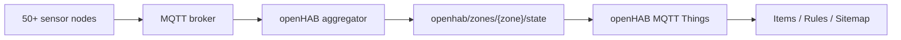

# Інтеграція з openHAB

## 1. Роль openHAB у проєкті

У цьому варіанті `openHAB` виступає не заміною `InfluxDB` чи `Grafana`, а окремим операційним шаром:

- приймає зональні MQTT-стани
- показує поточну ситуацію оператору
- запускає правила реагування
- формує короткі алерти для диспетчера

Архітектурно це дає поділ:

- `InfluxDB` + `PostgreSQL` + `Grafana` -> аналітика і історія
- `openHAB` -> правила, UI, оперативний моніторинг

## 2. Потік даних для openHAB



## 3. Чому потрібен окремий MQTT-агрегатор

Сирі повідомлення передаються у форматі `SenML`, що зручно для constrained-пристроїв і ingestion-сервісів, але менш зручно для прямого textual-конфігу `openHAB`.

Тому сервіс `aggregator/`:

- підписується на `airquality/+/+/measurements`
- рахує поточні середні по кожній зоні
- класифікує ризик
- публікує плоский JSON для `openHAB`

Приклад зонального JSON:

```json
{
  "zone": "traffic",
  "avg_pm25": 27.4,
  "avg_pm10": 43.9,
  "avg_co2": 587.2,
  "avg_no2": 41.8,
  "avg_temperature": 18.1,
  "avg_humidity": 57.4,
  "sensor_count": 13,
  "risk": "harmful",
  "alert_state": "ON",
  "updated_at": "2026-03-27T10:15:00Z"
}
```

## 4. Текстові конфіги openHAB

У репозиторії додано:

- `openhab/conf/things/airquality.things`
- `openhab/conf/items/airquality.items`
- `openhab/conf/rules/airquality.rules`
- `openhab/conf/sitemaps/airquality.sitemap`
- `openhab/conf/services/addons.cfg`

## 5. Що саме показує openHAB

- загальний стан міста
- найгіршу зону
- кількість активних алертів
- поточні значення `PM2.5`, `PM10`, `CO2`, `NO2` по кожній зоні
- поточний рівень ризику та прапорець тривоги

## 6. Правила в openHAB

`openHAB` правила в цьому проєкті:

- оновлюють текстове резюме для оператора
- логують появу небезпечних зон
- формують єдине повідомлення про активні pollution-alerts

## 7. Локальний запуск

Після `docker compose up --build`:

- `openHAB` доступний на `http://localhost:8080`
- `Grafana` доступна на `http://localhost:3000`

Таким чином один стенд показує і оперативний шар (`openHAB`), і аналітичний шар (`Grafana`).
