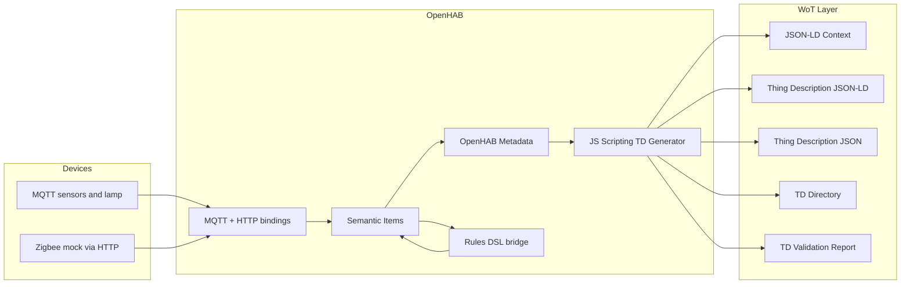

## Semantic IoT Gateway with OpenHAB 4.3

Цей репозиторій реалізує семантично анотовану IoT систему на базі OpenHAB 4.3.0,
яка об'єднує MQTT та Zigbee-mock пристрої в один gateway і автоматично генерує
W3C Web of Things Thing Description, TD Directory, JSON-LD context та validation
artifacts.

## Обов'язкові дослідження

1. **W3C WoT Thing Description**
   TD використовується як машинно-читаний опис Things, де OpenHAB Items
   відображаються у `properties`, `actions`, `events`, `forms`, `security` та
   `links`.
2. **JSON-LD**
   JSON-LD використано для семантичних анотацій TD через `@context`, кастомний
   vocabulary та URI-based терміни.
3. **SSN/SOSA Ontology**
   Семантика сенсорів та актуаторів моделюється через `sosa:ObservableProperty`,
   `sosa:Temperature`, `sosa:Humidity`, `sosa:Actuator`.
4. **OpenHAB Metadata**
   Семантичний шар побудовано через metadata namespaces `wot`, `sosa`, `iot`,
   `interop`; TD generator читає саме metadata, а не захардкоджені affordances.
5. **Matter, OCF, oneM2M**
   Для кожного gateway item додано protocol hints (`matterCluster`,
   `ocfResourceType`, `oneM2MResource`) як частину custom semantic annotations.

## Архітектура



## Standards Mapping

| Standard | How it is used in the project |
| --- | --- |
| WoT TD | Generates `properties`, `actions`, `events`, `forms`, `securityDefinitions`, `links` |
| JSON-LD | Adds `@context`, linked vocabulary, URI-based terms |
| SSN/SOSA | Describes sensors and actuators semantically |
| OpenHAB Semantic Model | Uses semantic tags and equipment/location grouping |
| OpenHAB Metadata | Stores TD mapping, capabilities, locations and interop hints |
| Matter | Mapped through metadata such as `OnOff`, `LevelControl`, `TemperatureMeasurement` |
| OCF | Mapped through `oic.r.*` resource types |
| oneM2M | Mapped through `m2m:*` resource hints |

## Repository Structure

```text
openhab_conf/
├── automation/js/wot-td.js
├── items/gateway.items
├── metadata/semantic.metadata
├── persistence/mapdb.persist
├── rules/bridge.rules
├── rules/wot-td.rules
├── services/addons.cfg
├── sitemaps/gateway.sitemap
├── things/mqtt.things
├── things/zigbee-mock.things
└── transform/
    ├── iot-gateway-context.jsonld
    ├── wot-td.js
    ├── wot-td-plain.js
    └── wot-td-directory-filter.js
```

## Базова конфігурація OpenHAB

- `OpenHAB 4.3.0`
- `MQTT binding`
- `HTTP binding`
- `JS Scripting automation`
- `JSONPATH transformation`
- Semantic Model через `items` tags/groups
- Semantic metadata через `openhab_conf/metadata/semantic.metadata`

`addons.cfg`:

```cfg
automation = jsscripting
transformation = jsonpath
```

Примітка: у цьому проєкті TD generation реалізований через file-based `JS Scripting`,
бо саме такий варіант стабільно працює в OpenHAB 4.3. Legacy JS transform scripts
залишено у `openhab_conf/transform/` як референсні артефакти.

## IoT Gateway Scenario

- MQTT симулює температуру, вологість і стан лампи.
- Zigbee mock надає HTTP API для switch, dimmer, temperature, battery, LQI.
- `bridge.rules` синхронізує MQTT, Zigbee та уніфіковані `Gateway_*` items.
- `wot-td.js` перетворює metadata-driven модель в WoT TD artifacts.

## TD Generation Algorithm

1. JS rule читає Thing-level metadata з item `TD_Directory`.
2. Rule знаходить усі `Gateway_*` items з namespace `wot="Property"`.
3. Для кожного item зчитуються:
   - TD mapping з namespace `wot`
   - semantic type з namespace `sosa`
   - capability/location з namespace `iot`
   - Matter/OCF/oneM2M hints з namespace `interop`
4. Generator створює:
   - `TD_Gateway_JSONLD`
   - `TD_Gateway_JSON`
   - `TD_Context_JSONLD`
   - `TD_Directory`
   - `TD_Validation_Status`
   - `TD_Validation_Report`
5. Directory search виконується через item `TD_Directory_Query`.
6. Validation перевіряє коректність базових TD полів, forms та discovery links.

## API Documentation

### Core OpenHAB Endpoints

- `GET /rest/items/Gateway_Temperature/state`
- `GET /rest/items/Gateway_Humidity/state`
- `GET /rest/items/Gateway_Light/state`
- `POST /rest/items/Gateway_Light`
- `GET /rest/items/Gateway_Dimmer/state`
- `POST /rest/items/Gateway_Dimmer`

### WoT Artifact Endpoints

- `GET /rest/items/TD_Gateway_JSONLD/state`  
  Thing Description in JSON-LD form
- `GET /rest/items/TD_Gateway_JSON/state`  
  Thing Description in plain JSON form
- `GET /rest/items/TD_Context_JSONLD/state`  
  Custom JSON-LD context
- `GET /rest/items/TD_Directory/state`  
  TD Directory entry list
- `GET /rest/items/TD_Validation_Status/state`  
  `VALID` or `INVALID`
- `GET /rest/items/TD_Validation_Report/state`  
  Validation report as JSON

### Discovery / Search API

- `POST /rest/items/TD_Directory_Query`
- `PUT /rest/items/TD_Directory_Query/state`
- `GET /rest/items/TD_Directory_Result/state`

Example query:

```json
{"type":"Gateway","location":"home","capability":"light","validated":true}
```

## Example Thing Description

```json
{
  "@context": [
    "https://www.w3.org/2019/wot/td/v1",
    "https://www.w3.org/ns/ssn/",
    "https://www.w3.org/ns/sosa/",
    "http://localhost:8080/rest/items/TD_Context_JSONLD/state"
  ],
  "id": "urn:openhab:thing:gateway",
  "title": "OpenHAB Gateway",
  "@type": ["iot:Gateway", "sosa:Platform"],
  "properties": {
    "temperature": {
      "type": "number",
      "readOnly": true,
      "observable": true,
      "@type": ["sosa:ObservableProperty", "sosa:Temperature"]
    },
    "light": {
      "type": "boolean",
      "readOnly": false,
      "observable": true,
      "@type": ["sosa:Actuator"]
    }
  },
  "actions": {
    "setLight": {
      "input": { "type": "boolean" }
    }
  },
  "events": {
    "temperatureChanged": {
      "data": { "type": "number", "unit": "degree Celsius" }
    }
  }
}
```

## Example Directory Entry

```json
[
  {
    "id": "urn:openhab:thing:gateway",
    "title": "OpenHAB Gateway",
    "types": ["iot:Gateway", "sosa:Platform"],
    "location": "home",
    "capabilities": ["temperature", "humidity", "battery", "linkquality", "light", "dimming"],
    "validationStatus": "VALID",
    "validated": true
  }
]
```

## Semantic Metadata Example

```text
Gateway_Light {
  wot="Property"
  wot=[ propertyName="light", actionName="setLight", actionInputType="boolean" ]
  sosa="sosa:Actuator"
  iot=[ capability="light", location="home" ]
  interop=[ matterCluster="OnOff", ocfResourceType="oic.r.switch.binary", oneM2MResource="m2m:actr" ]
}
```

## Demo / Verification Steps

1. Run the stack: `docker compose up -d --build`
2. Open OpenHAB: `http://localhost:8080`
3. Check sitemap `gateway`
4. Verify bridge updates:
   - `Gateway_Temperature`
   - `Gateway_Humidity`
   - `Gateway_Light`
   - `Gateway_Dimmer`
5. Open artifact endpoints:
   - `/rest/items/TD_Gateway_JSONLD/state`
   - `/rest/items/TD_Gateway_JSON/state`
   - `/rest/items/TD_Directory/state`
   - `/rest/items/TD_Validation_Report/state`
6. Submit a query to `TD_Directory_Query`
7. Verify `TD_Directory_Result`

## Files to Submit

- GitHub repository with the whole project
- OpenHAB configuration under `openhab_conf/`
- TD generation script: `openhab_conf/automation/js/wot-td.js`
- JSON-LD context: `openhab_conf/transform/iot-gateway-context.jsonld`
- API endpoint definitions documented in this README
- Architecture diagram in this README
- Example TD and Directory output in this README

## Manual Deliverable Still Needed

- Demo video `1-3 хв`, де показано:
  - запуск стеку
  - оновлення `Gateway_*` items
  - генерацію `TD_Gateway_JSONLD`
  - discovery через `TD_Directory_Query`
  - validation status/report
