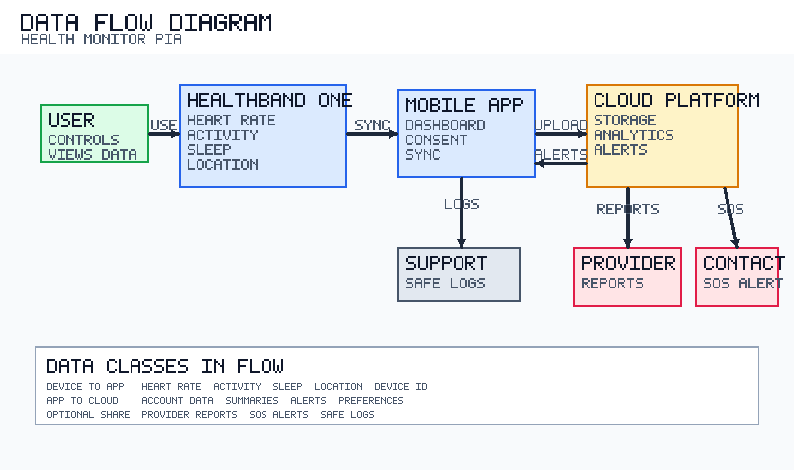

# Variant 1: Privacy Impact Assessment for a Smart Health Monitoring System
# Варіант 1: Privacy Impact Assessment для розумної системи моніторингу здоров'я

This document is bilingual and contains:

- English version
- Українська версія

# English Version

## Document Control

- Document title: Privacy Impact Assessment (PIA) for a wearable health monitoring device
- System name: `HealthBand One`
- Version: `1.1`
- Date: `2026-03-25`
- Language: English
- Prepared for: Variant 1 coursework submission

## Executive Summary

This Privacy Impact Assessment evaluates the privacy implications of `HealthBand One`, a wearable device that monitors heart rate, activity level, sleep patterns, and geolocation. The system includes the wearable device, a companion mobile application, a cloud platform for storage and analytics, and optional data sharing with healthcare providers and emergency contacts.

The assessment identifies major privacy risks related to sensitive health data, location tracking, unauthorized access, excessive retention, secondary use of data, and over-sharing with third parties. Because the system processes both health information and geolocation, the overall privacy impact is high unless strong controls are built into the architecture from the start.

This PIA recommends a Privacy by Design approach based on data minimization, explicit consent, strong authentication, encryption, retention limits, transparent user controls, and strict separation between core health monitoring and optional data sharing.

## 1. System Description

### 1.1 Device Name and Core Functions

`HealthBand One` is a wearable health monitoring device designed to support personal wellness, daily activity tracking, and safety-related features.

Core functions:

- Continuous heart rate monitoring
- Activity tracking based on movement and step count
- Sleep tracking and sleep quality estimation
- Optional geolocation tracking for route history, activity context, and emergency use
- Mobile app dashboard with trends, alerts, and privacy settings
- Cloud synchronization for backup, analytics, and multi-device access

### 1.2 Categories of Personal Data Collected

| Data category | Examples | Sensitivity level |
|---|---|---|
| Account data | name, email, age range, account ID | Medium |
| Device identifiers | serial number, app instance ID, IP address | Medium |
| Health data | heart rate, resting heart rate, anomaly alerts | High |
| Activity data | steps, workout duration, calories, intensity | Medium |
| Sleep data | sleep duration, sleep phases, wake intervals, sleep score | High |
| Location data | GPS coordinates, route history, home/work patterns | High |
| Support and diagnostics | sync errors, crash logs, firmware version | Low to Medium |

### 1.3 Purpose of Data Processing

The system processes personal data for the following purposes:

- To provide real-time health and activity monitoring
- To show trends and personalized insights in the mobile app
- To detect possible anomalies and generate wellness notifications
- To provide emergency and safety functionality when enabled
- To synchronize data between the wearable, app, and cloud account
- To improve service reliability and device quality
- To meet legal, security, and compliance obligations

### 1.4 Stakeholders and Responsible Parties

| Party | Role |
|---|---|
| User | Data subject and controller of optional sharing settings |
| Manufacturer | Device producer, firmware maintainer, security owner |
| Platform operator | Mobile app and cloud service provider |
| Healthcare provider | Optional recipient of user-approved reports |
| Emergency contact | Optional recipient of emergency alerts |

### 1.5 Assumed Data Lifecycle

1. The wearable collects raw sensor and optional location data.
2. Data is temporarily stored on the device.
3. The mobile app receives data through a secure local connection.
4. Selected data is synchronized to the cloud platform.
5. The platform stores, analyzes, and visualizes trends.
6. Optional reports or alerts may be shared with approved third parties.
7. Data is retained according to policy and then deleted or anonymized.

## 2. Data Flow Diagram

### 2.1 Embedded Diagram

### 2.2 Textual Description of Data Flow

- The user wears `HealthBand One`, which collects heart rate, activity, sleep, and optional location data.
- The wearable sends data to the companion mobile app over a secure short-range connection.
- The mobile app displays current values, trends, alerts, and privacy settings.
- The mobile app sends selected data to the cloud platform for storage, analytics, and backup.
- The cloud platform may send summaries or notifications back to the app.
- If explicitly enabled by the user, summary reports may be shared with a healthcare provider or emergency contact.
- Support functions may receive limited diagnostics data when the user requests assistance.

## 3. Privacy Risk Analysis Method

This assessment uses a qualitative risk model:

- Severity: `Low`, `Medium`, `High`
- Likelihood: `Low`, `Medium`, `High`

Severity reflects the level of harm to the user if the event occurs. Likelihood reflects how realistically the event may happen without sufficient controls.

## 4. Privacy Risk Register

| ID | Privacy risk | Impact description | Severity | Likelihood | Mitigation strategy | Responsible side |
|---|---|---|---|---|---|---|
| R1 | Unauthorized access to health records | Exposure of heart rate and sleep data may reveal medical conditions or vulnerabilities | High | Medium | Encryption in transit and at rest, MFA, secure sessions, access logging, security testing | Manufacturer + Platform |
| R2 | Location tracking reveals routine | Attackers or insiders may infer home, work, habits, and periods of absence | High | Medium | Location off by default, granular consent, approximate mode, short retention, delete controls | User + Platform + Manufacturer |
| R3 | Secondary use for profiling or advertising | Data may be reused beyond the original health purpose | High | Medium | Purpose limitation, separate opt-in, governance review, contractual limits on profiling | Platform + Manufacturer |
| R4 | Excessive data retention | Long retention increases exposure and enables invasive long-term profiling | Medium | High | Retention schedule, auto-delete raw location, store aggregated summaries, delete/export tools | Platform |
| R5 | Sensitive inference from combined data | Combined heart rate, sleep, activity, and location may reveal illness, stress, religion, or private habits | High | Medium | Data minimization, pseudonymization, separation of identifiers, restricted access, privacy review | Platform + Manufacturer |
| R6 | Over-sharing with providers or contacts | Shared reports may disclose more data than necessary | Medium | Medium | Summary-only sharing, preview before sending, fine-grained scopes, expiring access, audit trail | User + Platform |
| R7 | Weak defaults or confusing consent | Users may enable tracking or sharing without fully understanding it | High | Medium | Privacy-protective defaults, layered notices, clear consent flows, just-in-time prompts | Manufacturer + Platform |
| R8 | Diagnostics logs leak personal data | Logs may contain identifiers, timestamps, or health-related references | Medium | Medium | Log minimization, masking, short retention, support access control, consent for upload | Platform + Manufacturer |

## 5. Detailed Risk Discussion

### R1. Unauthorized Access to Health Records

Health and sleep data are highly sensitive. If compromised, they may be used for discrimination, fraud, or reputational harm.

### R2. Location Tracking Reveals Daily Routine

Location data can reveal where the user lives, works, exercises, travels, or seeks treatment. It is highly identifying even when other data is pseudonymized.

### R3. Secondary Use Beyond Health Monitoring

Users expect health data to support wellness functions, not advertising, insurance scoring, or cross-platform profiling.

### R4. Excessive Retention

Even secure systems become riskier when they store detailed personal data for too long.

### R5. Sensitive Inferences from Combined Data

Combined datasets can reveal more than the raw readings themselves, including patterns linked to illness, stress, or lifestyle.

### R6. Over-Sharing Through External Reports

Healthcare or emergency features should share only the minimum information needed for the purpose.

### R7. Weak Defaults and Consent Fatigue

If privacy-sensitive features are enabled by default, users may unknowingly expose high-risk data.

### R8. Diagnostic Leakage

Support channels should not become a hidden way to collect unnecessary personal data.

## 6. Mitigation Strategy Summary

### 6.1 Technical Controls

- Encrypt data in transit and at rest
- Apply role-based access control
- Use multi-factor authentication
- Separate location data from core health data when feasible
- Prefer local or on-phone preprocessing
- Minimize diagnostics logging
- Automate retention and deletion

### 6.2 Organizational Controls

- Maintain a formal privacy policy
- Perform regular privacy and security audits
- Review new features before release
- Maintain incident response procedures
- Train support and operations staff

### 6.3 User Controls

- Provide a privacy dashboard
- Allow disabling geolocation
- Allow export and deletion of personal data
- Allow revocation of sharing permissions
- Show previews before external sharing

## 7. Privacy by Design Recommendations

1. Data minimization by default.
Collect only the minimum data needed for each selected feature.

2. Privacy-protective defaults.
Geolocation and third-party sharing should be disabled by default.

3. Purpose separation.
Health monitoring, analytics, support, and marketing must remain separate.

4. Granular consent.
Collect separate consent for location, provider sharing, emergency features, and analytics improvement.

5. Short raw-data retention.
Keep high-resolution raw data only as long as operationally necessary.

6. Transparency.
Users must understand what is collected, why, where it is stored, and who can access it.

7. User autonomy.
Users must be able to pause tracking, delete history, revoke sharing, and download their data.

8. Secure architecture.
Use secure coding, encryption, least privilege, and audit logging.

9. Pseudonymization.
Separate direct identifiers from analytics data where possible.

10. Continuous review.
New features should trigger an updated PIA before deployment.

## 8. Recommended Retention Approach

| Data type | Recommended retention |
|---|---|
| Raw heart rate telemetry | 30 to 90 days |
| Activity summaries | Up to account lifetime, subject to deletion rights |
| Detailed sleep sessions | 90 days to 1 year |
| Raw geolocation traces | 7 to 30 days maximum |
| Aggregated trend summaries | Up to account lifetime, subject to deletion rights |
| Support diagnostics | 30 days or less |

## 9. Residual Risk Assessment

After mitigation, the remaining residual risk is:

- High residual concern: location privacy and sensitive inferences
- Medium residual concern: unauthorized access and over-sharing
- Low to medium residual concern: diagnostics leakage and retention if deletion is enforced

The system is acceptable only if location remains optional, defaults stay privacy-protective, and all sharing is transparent and reversible.

## 10. Final Conclusion

`HealthBand One` can deliver clear health and wellness value, but it processes highly sensitive categories of data. The combination of biometrics, sleep behavior, and geolocation creates significant privacy risk if the system is not designed carefully.

The PIA concludes that deployment is acceptable only with strong Privacy by Design controls, especially data minimization, explicit consent, strong security, short retention for raw data, and user control over sharing and deletion.

# Українська версія

## Контроль документа

- Назва документа: Privacy Impact Assessment (PIA) для носимого пристрою моніторингу здоров'я
- Назва системи: `HealthBand One`
- Версія: `1.1`
- Дата: `2026-03-25`
- Мова: Українська
- Підготовлено для: здачі завдання за варіантом 1

## Короткий висновок

Цей документ оцінює вплив на приватність системи `HealthBand One` - носимого пристрою, що відстежує серцевий ритм, рівень активності, сон і геолокацію. Система складається з wearable-пристрою, мобільного застосунку, хмарної платформи для зберігання й аналітики, а також опційного обміну даними з медичними працівниками та екстреними контактами.

Оцінка визначає основні ризики приватності, пов'язані з обробкою чутливих медичних даних, відстеженням місцезнаходження, несанкціонованим доступом, надмірним зберіганням, вторинним використанням даних і надмірним поширенням інформації третім сторонам. Оскільки система обробляє і медичні дані, і геолокацію, загальний вплив на приватність є високим, якщо не впровадити сильні механізми захисту з самого початку.

PIA рекомендує підхід Privacy by Design, заснований на мінімізації даних, явній згоді, сильній автентифікації, шифруванні, обмеженні термінів зберігання, прозорих налаштуваннях для користувача та чіткому відокремленні основних health-функцій від опційного обміну даними.

## 1. Опис системи

### 1.1 Назва пристрою та основні функції

`HealthBand One` - це носимий пристрій моніторингу здоров'я, призначений для персонального wellness-моніторингу, відстеження щоденної активності та функцій безпеки.

Основні функції:

- Безперервний моніторинг серцевого ритму
- Відстеження активності на основі руху та кількості кроків
- Відстеження сну та оцінка його якості
- Опційне відстеження геолокації для маршруту, контексту активності та екстрених випадків
- Мобільний застосунок з трендами, сповіщеннями та privacy-налаштуваннями
- Хмарна синхронізація для резервного копіювання, аналітики та доступу з кількох пристроїв

### 1.2 Категорії персональних даних, що збираються

| Категорія даних | Приклади | Рівень чутливості |
|---|---|---|
| Облікові дані | ім'я, email, віковий діапазон, ID акаунта | Середній |
| Ідентифікатори пристрою | серійний номер, ID інстансу застосунку, IP-адреса | Середній |
| Медичні дані | серцевий ритм, пульс у спокої, аномальні сповіщення | Високий |
| Дані активності | кроки, тривалість тренування, калорії, інтенсивність | Середній |
| Дані про сон | тривалість сну, фази сну, пробудження, sleep score | Високий |
| Дані геолокації | GPS-координати, історія маршрутів, патерни дім/робота | Високий |
| Підтримка та діагностика | помилки синхронізації, crash logs, версія прошивки | Низький або середній |

### 1.3 Цілі обробки даних

Система обробляє персональні дані для таких цілей:

- Надання моніторингу здоров'я та активності в реальному часі
- Відображення історичних трендів і персоналізованих інсайтів у застосунку
- Виявлення можливих аномалій і формування wellness-сповіщень
- Робота emergency- та safety-функцій, якщо вони ввімкнені
- Синхронізація даних між пристроєм, застосунком і хмарним акаунтом
- Підвищення стабільності сервісу та якості пристрою
- Виконання юридичних, безпекових і compliance-вимог

### 1.4 Зацікавлені сторони та відповідальні учасники

| Сторона | Роль |
|---|---|
| User | Суб'єкт даних і керує налаштуваннями опційного поширення |
| Manufacturer | Виробник пристрою, відповідальний за прошивку та безпеку |
| Platform operator | Постачальник мобільного застосунку та хмарної платформи |
| Healthcare provider | Опційний отримувач звітів за згодою користувача |
| Emergency contact | Опційний отримувач екстрених сповіщень |

### 1.5 Припущений життєвий цикл даних

1. Wearable-пристрій збирає сирі сенсорні та опційні геодані.
2. Дані тимчасово зберігаються на пристрої.
3. Мобільний застосунок отримує дані через захищене локальне з'єднання.
4. Обрана частина даних синхронізується з хмарною платформою.
5. Платформа зберігає, аналізує та візуалізує тренди.
6. Опційні звіти або сповіщення можуть бути передані дозволеним третім сторонам.
7. Дані зберігаються згідно з політикою, після чого видаляються або анонімізуються.

## 2. Діаграма потоку даних

### 2.1 Вбудована діаграма

### 2.2 Текстовий опис потоку даних

- Користувач носить `HealthBand One`, який збирає дані про серцевий ритм, активність, сон і опційно геолокацію.
- Пристрій передає дані в мобільний застосунок через захищене короткодистанційне з'єднання.
- Мобільний застосунок відображає поточні значення, тренди, сповіщення та налаштування приватності.
- Мобільний застосунок передає частину даних у хмарну платформу для зберігання, аналітики та резервного копіювання.
- Хмарна платформа може повертати у застосунок підсумки або сповіщення.
- Якщо користувач це явно дозволив, короткі звіти можуть бути передані лікарю або екстреному контакту.
- Функції підтримки можуть отримувати обмежені діагностичні дані, коли користувач звертається по допомогу.

## 3. Метод оцінки ризиків приватності

У цій оцінці використовується якісна модель ризику:

- Severity: `Low`, `Medium`, `High`
- Likelihood: `Low`, `Medium`, `High`

Severity відображає рівень шкоди для користувача, якщо подія станеться. Likelihood відображає, наскільки реалістично така подія може відбутися без достатніх захисних механізмів.

## 4. Реєстр ризиків приватності

| ID | Ризик приватності | Опис впливу | Severity | Likelihood | Стратегія зменшення ризику | Відповідальна сторона |
|---|---|---|---|---|---|---|
| R1 | Несанкціонований доступ до медичних записів | Розкриття даних про пульс і сон може виявити медичні стани або вразливості | High | Medium | Шифрування при передачі та зберіганні, MFA, захищені сесії, логування доступу, security testing | Manufacturer + Platform |
| R2 | Геолокація розкриває щоденний маршрут | Зловмисники або інсайдери можуть визначити дім, роботу, звички та час відсутності | High | Medium | Геолокація вимкнена за замовчуванням, granular consent, approximate mode, коротке зберігання, delete controls | User + Platform + Manufacturer |
| R3 | Вторинне використання даних для профілювання або реклами | Дані можуть використовуватися поза первинною health-метою | High | Medium | Purpose limitation, окремий opt-in, governance review, контрактні обмеження на профілювання | Platform + Manufacturer |
| R4 | Надмірне зберігання даних | Тривале зберігання збільшує наслідки витоку та створює ризик довгострокового профілювання | Medium | High | Політика retention, auto-delete для сирої геолокації, збереження агрегованих summary, delete/export tools | Platform |
| R5 | Чутливі висновки з комбінованих даних | Серцевий ритм, сон, активність і геолокація разом можуть виявити хворобу, стрес, релігійні чи приватні звички | High | Medium | Data minimization, pseudonymization, розділення ідентифікаторів, обмежений доступ, privacy review | Platform + Manufacturer |
| R6 | Надмірне поширення даних лікарям або контактам | Передані звіти можуть містити більше даних, ніж потрібно | Medium | Medium | Summary-only sharing, preview before sending, fine-grained scopes, expiring access, audit trail | User + Platform |
| R7 | Небезпечні дефолтні налаштування або неясна згода | Користувачі можуть увімкнути відстеження або поширення, не усвідомлюючи наслідків | High | Medium | Privacy-protective defaults, layered notices, clear consent flows, just-in-time prompts | Manufacturer + Platform |
| R8 | Діагностичні логи розкривають персональні дані | Логи можуть містити ідентифікатори, timestamps або health-події | Medium | Medium | Log minimization, masking, short retention, support access control, consent for upload | Platform + Manufacturer |

## 5. Детальний розбір ризиків

### R1. Несанкціонований доступ до медичних записів

Дані про здоров'я та сон є дуже чутливими. У разі компрометації вони можуть використовуватися для дискримінації, шахрайства або репутаційної шкоди.

### R2. Відстеження геолокації розкриває щоденний маршрут

Геолокація може показати, де користувач живе, працює, тренується, подорожує або звертається по медичну допомогу. Це одна з найчутливіших категорій даних.

### R3. Вторинне використання поза health-моніторингом

Користувачі очікують, що такі дані використовуються для wellness-функцій, а не для реклами, страхового скорингу чи міжплатформного профілювання.

### R4. Надмірне зберігання

Навіть безпечні системи стають ризикованішими, якщо вони зберігають детальні персональні дані занадто довго.

### R5. Чутливі висновки з комбінованих наборів даних

Комбінація різних джерел даних може розкрити більше, ніж самі сирі показники, включно зі способом життя, стресом чи можливими захворюваннями.

### R6. Надмірне поширення через зовнішні звіти

Функції для лікарів або emergency-контактів мають передавати лише мінімально необхідну інформацію.

### R7. Слабкі дефолти та втома від consent-вікон

Якщо privacy-чутливі функції увімкнені за замовчуванням, користувач може випадково відкрити критично важливі дані.

### R8. Витік через діагностику

Канали підтримки не повинні ставати прихованим способом збору зайвих персональних даних.

## 6. Підсумок стратегій зменшення ризику

### 6.1 Технічні заходи

- Шифрування даних при передачі та зберіганні
- Role-based access control
- Multi-factor authentication
- Відокремлення геолокації від базових health-даних, де це можливо
- Локальна або on-phone попередня обробка
- Мінімізація логування діагностики
- Автоматичне видалення та контроль retention

### 6.2 Організаційні заходи

- Формальна privacy policy
- Регулярні privacy- та security-аудити
- Перевірка нових функцій до релізу
- Процедури реагування на інциденти
- Навчання співробітників підтримки та операцій

### 6.3 Користувацькі контролі

- Privacy dashboard
- Можливість вимкнути геолокацію
- Можливість експорту та видалення персональних даних
- Можливість відкликання дозволів на поширення
- Попередній перегляд перед передачею третім сторонам

## 7. Рекомендації Privacy by Design

1. Мінімізація даних за замовчуванням.
Збирати лише ті дані, які потрібні для обраної функції.

2. Приватні дефолтні налаштування.
Геолокація та передача третім сторонам мають бути вимкнені за замовчуванням.

3. Розділення цілей обробки.
Health-моніторинг, аналітика, підтримка та маркетинг мають бути чітко розділені.

4. Гранулярна згода.
Потрібно окремо збирати згоду на геолокацію, обмін із лікарем, emergency-функції та покращення аналітики.

5. Коротке зберігання сирих даних.
Сирі детальні дані слід зберігати лише настільки довго, наскільки це справді потрібно.

6. Прозорість.
Користувач має розуміти, що саме збирається, навіщо, де зберігається і хто має доступ.

7. Автономія користувача.
Користувач повинен мати змогу поставити трекінг на паузу, видалити історію, відкликати дозволи та завантажити свої дані.

8. Захищена архітектура.
Потрібно використовувати secure coding, шифрування, least privilege та audit logging.

9. Псевдонімізація.
За можливості треба відокремлювати прямі ідентифікатори від аналітичних даних.

10. Безперервний privacy review.
Кожна нова функція має проходити оновлену PIA перед розгортанням.

## 8. Рекомендований підхід до зберігання

| Тип даних | Рекомендований термін зберігання |
|---|---|
| Сирі дані серцевого ритму | 30-90 днів |
| Підсумки активності | До строку існування акаунта, з урахуванням права на видалення |
| Детальні сесії сну | 90 днів - 1 рік |
| Сирі геодані | Максимум 7-30 днів |
| Агреговані тренди | До строку існування акаунта, з урахуванням права на видалення |
| Діагностичні логи | 30 днів або менше |

## 9. Оцінка залишкового ризику

Після впровадження заходів залишковий ризик оцінюється так:

- Високий залишковий ризик: приватність геолокації та чутливі висновки з комбінованих даних
- Середній залишковий ризик: несанкціонований доступ і надмірне поширення
- Низький або середній залишковий ризик: діагностичні витоки та retention, якщо автоматичне видалення працює коректно

Систему можна вважати прийнятною лише за умови, що геолокація залишається опційною, дефолтні налаштування залишаються privacy-friendly, а будь-яке поширення даних є прозорим і оборотним.

## 10. Фінальний висновок

`HealthBand One` може дати реальну користь для health- і wellness-моніторингу, але система обробляє дуже чутливі категорії даних. Комбінація біометрії, даних про сон і геолокації створює значний privacy-ризик, якщо архітектура не спроєктована обережно.

PIA робить висновок, що таку систему можна впроваджувати лише за наявності сильних Privacy by Design механізмів, насамперед мінімізації даних, явної згоди, сильної безпеки, короткого зберігання сирих даних і контролю користувача над поширенням та видаленням.
